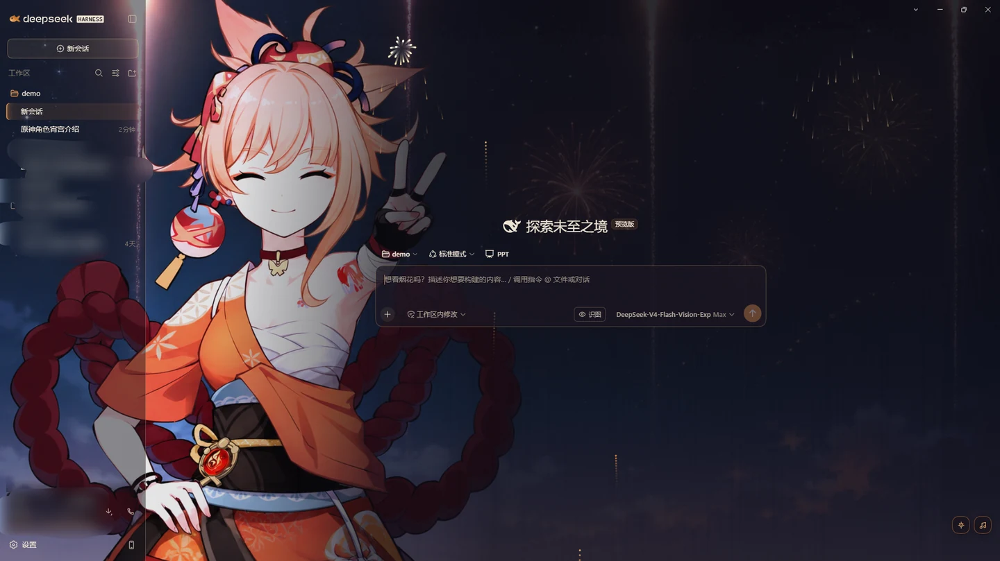
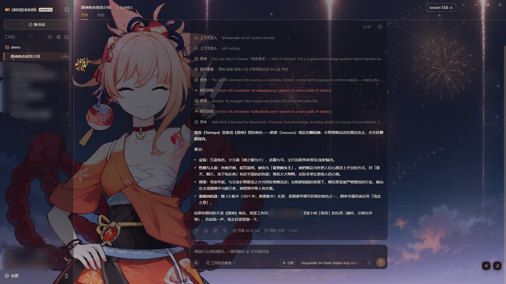
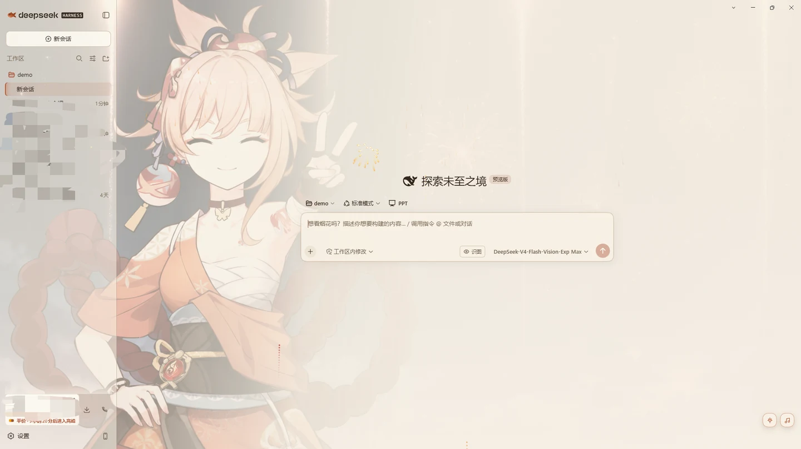
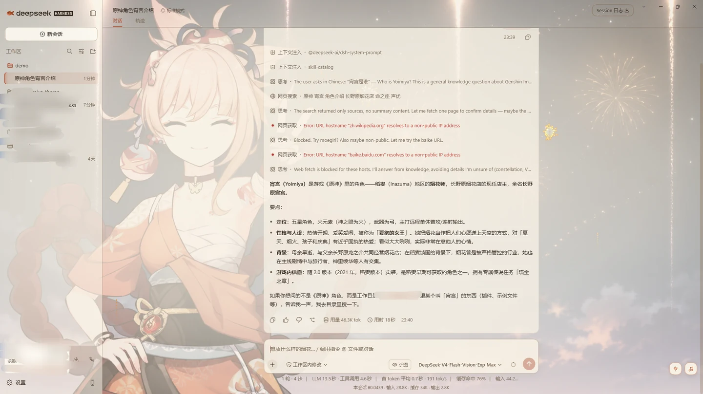

# 宵宫主题 · dsh-yoimiya-theme

给 **DeepSeek Harness** 做的《原神》宵宫主题。

暗色是**夏祭夜**——烟花在夜色里炸开的暖橙；亮色是**和纸昼**——和纸米色的暖光。
跟随 DSH 自己的明暗设置切换，不用另外配置。

**Web 端和 DSH Desktop 都能装。**

## 效果

| | 首页 | 对话 |
| --- | --- | --- |
| **夏祭夜** |  |  |
| **和纸昼** |  |  |

左边是首页，右边是对话。注意壁纸的变化：**首页时它全亮，一开始对话就自动退到
后面**，把屏幕中心让给正文。

## 亮点

**烟花是会动的。** 右下角有个烟花按钮。引线带着尾迹升上去，到点炸开，火星受重力
往下落、慢慢熄灭。升起速度、密度、爆炸大小各三档，也可以关掉。

**一个装你自己歌单的播放器。** 右下角的音乐按钮：封面、播放 / 暂停、上一首 /
下一首、进度条（点击跳转）、音量（**记住上次的值**），还有可折叠的曲目列表。
曲库就是你电脑上的一个文件夹——把歌丢进去就能播。

**壁纸会看你在做什么。** 首页全亮，进入对话后退成氛围层，不挡正文。

**两档各有各的样子。** 亮档不是把暗档反相：夏祭夜是夜里的烟花摊，和纸昼是白天的
和纸与暖光。

**画面几乎全是画出来的。** 除了那张壁纸，烟花、灯笼、金鱼、波纹、纸纹都是代码
生成的，没有一个像素来自贴图——所以整包很小，换色也只是改数值。

还有几处小的：侧边栏的官方标识换成了自绘的金鱼；选中的会话左边有一道橙色竖条；
输入框的占位文案是宵宫台词。

## 烟花粒子

点右下角的烟花按钮。

- **升起速度 / 密度 / 爆炸** 各三档，另有关闭开关
- 系统开了「减少动态效果」时默认关闭
- **切到别的窗口就停**，不在后台耗电
- 面板底部有实时读数（帧率、粒子数）。觉得烟花碍事想关掉之前，可以先看看它到底
  占多少

## 本地音乐播放器

点右下角的音乐按钮。

### 曲库就是你电脑上的一个文件夹

没有清单文件要维护。**一首歌 = 一个音频文件**：

```
<DSH_HOME>/yoimiya-music/
├── 某首歌.mp3
├── 某首歌.jpg        ← 同名图片就是它的封面（可选）
└── 另一首.flac
```

Windows 上 `<DSH_HOME>` 默认是 `%APPDATA%\dsh-desktop\harness`。
**打开音乐面板就会显示实际路径**，曲库为空时也会显示。

### 两种添加方式，效果一样

1. **直接拖进去**——把音频文件（想配封面就放一张同名的图）丢进上面那个文件夹，
   然后收起再打开音乐面板（面板每次打开都会重读目录）
2. **用面板上的「添加歌曲」**——选音频（必须）和封面（可选）。封面可以在面板里
   拖动、缩放，裁成方图

**封面不是必须的**：没有封面的歌会显示主题的金鱼。

| | |
| --- | --- |
| 音频 | `.mp3` `.m4a` `.aac` `.ogg` `.oga` `.opus` `.wav` `.flac` `.webm` |
| 封面 | `.jpg` `.jpeg` `.png` `.webp` `.gif` `.avif` |

**主题不内置任何音乐。** 曲库一开始是空的，里面放什么完全由你决定。

## 你的文件去哪了

**不上传。任何地方都不上传。**

「添加歌曲」做的事只有一件：**把你选的文件复制进你电脑上的一个文件夹**（就是上面
那个 `yoimiya-music`）。它走的是应用自己的接口，不经过任何第三方服务器。

- 主题**不联网**——代码里没有任何对外请求，它用到的图片都来自本机
- 你放的歌和封面**留在本机**，不会被读取、分析或发送到任何服务器
- 卸载主题**不会删除**你的曲库文件夹——你的文件还是你的
- **唯一的例外是你自己开的远程访问。** 主题的接口由 DSH 自己的服务提供，默认只
  监听本机；但如果你启用了远程访问，从别的设备打开界面时，播放器读的是 **DSH
  所在那台机器**的曲库。文件仍然没有离开那台机器，只是不再是你手里这台

## 看着累不累

- **不用纯黑，也不用纯白。** 纯黑底配白字，眼睛要在明暗之间反复大幅调节，是长文
  阅读最累的一种组合；这里用暖靛黑配暖米白、和纸米配墨棕
- **对比度都量过**：暗档正文 13.99:1、亮档 13.28:1。无障碍标准（WCAG AA）要求
  4.5:1；次要文字、占位文案、错误 / 成功 / 警告色也各自达标
- **语法高亮是暖色的**，换掉了默认那套高饱和的蓝与紫
- 代码块用暖调底色，字体保持等宽，不影响读代码

## 性能

粒子是唯一一直在跑的东西，所以专门优化过：**切到别的窗口自动停**，主题被卸载时
相关的东西一并清理干净，画布分辨率会按屏幕大小自动退让——4K 屏上不会白烧电。

这些不用信我说，**烟花面板底部有实时帧率和粒子数**，自己看一眼就知道。

## 安装

三种方式任选一种。**Web 端与 DSH Desktop 用的是同一个 profile**，前两种在两边都
适用；桌面端只是不带 `dsh` 命令行工具。

### 应用内插件市场

设置 → 插件 → 搜索 `yoimiya` → 安装。

条目通过 [`awesome-dsh-plugin`](https://github.com/awesome-dsh-plugin/awesome-dsh-plugin)
目录分发；还没上架时，用下面两种方式中的任意一种。

### 命令行

```bash
dsh plugin --profile web add github:CosmerHomura/dsh-yoimiya-theme
```

（`--profile web` 指的是 DSH 的 profile 名字，不是"只装给网页版"。）

### DSH Desktop 手动安装

桌面端不带 `dsh` 命令，用仓库里的脚本：

1. **完全退出 DSH Desktop**
2. 右键 `tools\install-local.ps1` →「使用 PowerShell 运行」
3. 启动 DSH，刷新页面

脚本会先确认 DSH 已退出、备份配置，再执行安装并逐项校验。任一步失败都会停下，
并打印回滚命令。

### 装好了但界面没变？

1. 先刷新页面（`Ctrl+R`）
2. 还不行就**完全退出 DSH** 再启动一次
3. Host 日志里出现这一行就说明装上了：

```
[yoimiya-theme] Host 半边就绪（9/9 条路由）
```

## 卸载

**应用内**：设置 → 插件 → 找到 `dsh-yoimiya-theme` → 移除。

**命令行**：

```bash
dsh plugin --profile web remove dsh-yoimiya-theme
```

**手动装的**：

```powershell
& "$env:APPDATA\dsh-desktop\harness\.desktop-bin\pnpm.cmd" `
  --dir "$env:APPDATA\dsh-desktop\harness\profiles\web" `
  remove dsh-yoimiya-theme
```

卸载后配色与样式会一并撤销，不留残留；**曲库文件夹与里面的音乐不受影响。**

## 兼容性

- DSH 0.8.1 及以上
- **Web 端与 DSH Desktop 都能用**，两边是同一套界面
- 明暗两档跟随 DSH 的 `light` / `dark` / `system` 设置
- 万一粒子画不出来（环境不支持），主题本身照常工作

## 授权

MIT，见 [`LICENSE`](./LICENSE)。

角色「宵宫」为米哈游《原神》角色，本主题为非商业同人作品。

---

## 想改点什么 / 报问题

**欢迎 PR，也欢迎提 issue。**

这个主题还在继续打磨，已知可以更好的方向：

- **更多意象**：更多宵宫相关的配色档，或背景变体
- **播放器**：播放模式（单曲循环 / 随机）、歌词
- **粒子**：现在这个密度够用了；如果将来想把粒子数做大，渲染方式需要换一种

动代码前有几条值得知道：

- 改 `bundle/host.js`（本地接口）**必须完全重启 DSH** 才生效；改 `bundle/client.js`
  （样式、粒子、播放器界面）存盘后刷新页面就行
- 改过 `assets/` 里的任何图片，要把 `bundle/client.js` 里的 `ASSET_V` 加一，否则
  新图出不来（浏览器会缓存旧图）
- 明暗两档的标识必须保持同一条鱼——只换颜色，不能只改一份

提交前跑一遍仓库自带的自检：

```bash
node tools/verify.mjs          # 配色对比度、禁用项、发布清单、标识几何
node tools/live-check.mjs      # 确认运行中的 DSH 到底在发哪一版
node tools/test-cover-flow.mjs # 封面流程回归
node tools/test-list-songs.mjs # 曲库列举回归
```

设计推导、改配色与换图的具体步骤，见 [`DESIGN.md`](./DESIGN.md)。
